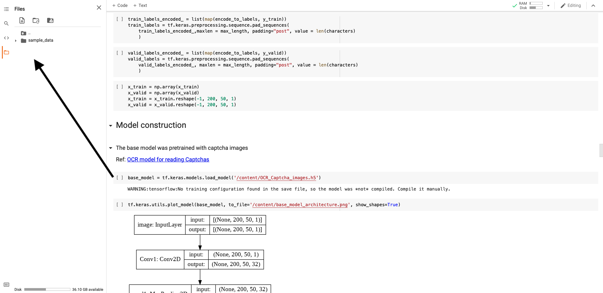

## ATML Project

This repository contains the code for the ATML Project (2020-2021) by the group of Maddalena, Marco, and Kostas.

Link to our dataset:
[Handwriting recognition](https://www.kaggle.com/landlord/handwriting-recognition)

**How to run the notebooks in Google Colab**

Install Kaggle to create a direct connection from Colab to Kaggle. To do this, it is necessary first of all to have a Kaggle profile and to create a new API token from your account settings. In this way, a kaggle.json file will be created and stored in your desired destination folder. This file will then be uploaded when asked by the script. This created connection between Colab and Kaggle could be found in the following lines:

```python
! pip install -q kaggle
from google.colab import files
files.upload()
! mkdir ~/.kaggle
! cp kaggle.json ~/.kaggle/
! chmod 600 ~/.kaggle/kaggle.json
!kaggle datasets download -d landlord/handwriting-recognition
```
Also, a GPU must be used in order to process images fast.

**Note for Handwriting_Recognition_PreBuilt_Model**

The code about the usage of th prebuilt model (Transfer Learning approach on handwriting recognition) needs to use the model in "OCR_Captcha_images.h5" file. Upload the file by drag and drop the file into the Files section of Google Colab.
The image below shows at which line of code you need the file and in which section to drag and drop.



----

**:clipboard: Project structure**


### 1st part: preprocessing (Maddalena)

* Load the dataset
* Crop and clean the images

### 2nd part: CNN + RNN (Kostas)

* Apply CRN and RNN from scratch
* Try different parapeters for best performance

### 3rd part: Comparison with prebuilt models (Marco)

* Find a good pre-built model
* Train and tune the model
