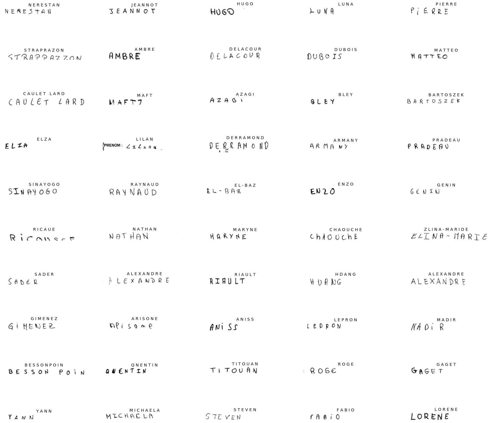

# **HANDWRITING RECOGNITION ALGORITHM**

## Advanced Topics in Machine Learning - Project Report

**Free University of Bozen-Bolzano**

:date: 10/02/2021

**Students:**

* *Marco Zenere*, ID: 18484
* *Kostas Tzoumpas*, ID: 18696
* *Maddalena Feder*, ID: 14125

[[_TOC_]]

## Introduction

Aim of this project is to apply the theoretical topics seen during the lectures in order to obtain our own Deep Learning implementation, which consists of the developing of a handwriting recognition algorithm. The starting point is the dataset that could be found [here](https://www.kaggle.com/landlord/handwriting-recognition). In the dataset, there are 206,799 first names and 207,024 surnames, for a total dimension of 1.32 GB. The data are divided into a training set (331,059), testing set (41,382) and validation set (41,382). Each input file consists of an image of a handwritten name and then in some separated CSV files, the corresponding name's label could be found. The purpose of the here described implementation consists of developing a versatile algorithm in order to recognize the characters and then be able to translate them into a digital format. This, with further implementations, could be something very useful, for example instead of scanning some paper documents to have a digital version of them, it is possible in this way to automatically translate what is written over them in a digital format.

Some pictures of the train dataset could be visualized below:


Some other pictures, but of the validation datasets, have also been displayed:


The different aspects of the whole implementation, by highlighting particular challenges that were faced and the results that have been achieved, are reported in the next paragraphs. In particular, three are the main steps in which the whole project has been divided:

*  **Data preprocessing:** Here the dataset has been loaded. After the visualization of some of the pictures inside it, and after the distinction between train and validation datasets (the two sets that have been exploited) and the removing of the files denoted as "unreadable", a cropping operation of the images has been carried out;
* **CNN and RNN:** After the data preprocessing, the main training of the model has been performed. First, a convolutional neural network has been implemented to read the images, and then a recurrent neural network is used to translate the main content of the pictures in a digital format;
* **Comparison with prebuilt models:** As last step of this project, a comparison with other prebuilt models has been performed. Thanks to this, some possible improvements of the developed network are possible.

For this project some notebooks present in [Kaggle](https://www.kaggle.com/landlord/handwriting-recognition/notebooks) website have been taken as reference. The here presented script, arranged in a notebook format, has been run in [Google Colab](https://colab.research.google.com/notebooks/intro.ipynb). The whole dataset has not been completely loaded, since not enough memory (RAM) was available.  


## Data preprocessing

In the data preprocessing phase, after having imported the standard used libraries (e.g. tensorflow, numpy, keras and matplotlib), the connection between Kaggle and Colab has been created, as described in the README file. Then, the dataset has been downloaded and it is possible to proceed by extracting the whole dataset, as shown below both for the train and validation datasets.

```python
PATH='dataset/train_v2'
BATCH_SIZE = 32
IMG_SIZE = (130, 780)  

train_dataset = image_dataset_from_directory(PATH,
                                             shuffle=True,
                                             batch_size=BATCH_SIZE,
                                             image_size=IMG_SIZE)
```

```python
PATH='dataset/validation_v2'
BATCH_SIZE = 32
IMG_SIZE = (130, 780)

val_dataset = image_dataset_from_directory(PATH,
                                           shuffle=True,
                                           batch_size=BATCH_SIZE,
                                           image_size=IMG_SIZE)
```

After having visualized the first nine pictures for both the extracted datasets, the CSV file, thanks to pandas library, has been read to look at the pictures' names. They are identified under the "IDENTITY" target.

```python
import pandas as pd
train_names = pd.read_csv('dataset/written_name_train_v2.csv')
train_names
```

The output is:

|        | FILENAME         | IDENTITY      |
| ------ | ---------------- | ------------- |
| 0      | TRAIN_00001.jpg  | BALTHAZAR     |
| 1      | TRAIN_00002.jpg  | SIMON         |
| 2      | TRAIN_00003.jpg  | BENES         |
| 3      | TRAIN_00004.jpg  | LA LOVE       |
| 4      | TRAIN_00005.jpg  | DAPHNE        |
| ...    | ...              | ...           |
| 330956 | TRAIN_330957.jpg | LENNY         |
| 330957 | TRAIN_330958.jpg | TIFFANY       |
| 330958 | TRAIN_330959.jpg | COUTINHO DESA |
| 330959 | TRAIN_330960.jpg | MOURAD        |
| 330960 | TRAIN_330961.jpg | HELOISE       |

Some pictures are labeled as "UNREADABLE" in the dataset's description, consequently they have been removed from both the datasets.

```python
unreadable = train_names[train_names['IDENTITY'] == 'UNREADABLE']
unreadable.reset_index(inplace = True, drop = True)
```

Some of these unreadable pictures are displayed below:


Some labels are in lowercase. For this reason, they have been converted to uppercase. Then, a reset of the dataset to remove the indexes of the unreadable pictures should be performed.

```python
pd.options.mode.chained_assignment = None
train_names['IDENTITY'] = train_names['IDENTITY'].str.upper()
val_names['IDENTITY'] = val_names['IDENTITY'].str.upper()
```

```python
train_names.reset_index(inplace = True, drop = True)
val_names.reset_index(inplace = True, drop = True)
```

The most laborious step of this preprocessing part is the dropping process. Indeed, to let the network work in the most efficient way,  it is necessary that the pictures will be as much clean as possible. For this reason, some different tests have been performed to crop the pictures in the better way. Two approaches have been adopted. Each of these approaches has been tested in a single way and also a merged possibility of them has also been verified. At the end, the second approach is the one that has been kept and that leads to the highest percentage result in the network implementation. However, also a brief description of the first approach and of the merged one is provided. All the different implemented crop functions take advantage of the PIL library to open the image and loading its gray-scale pixels. The idea behind the first approach was to start from the lower part of the picture and go up until the first white line is found. This found white line is the lower line of the cropped picture. Then the function continues to go up, and after some found black pixels, goes up again until it finds a white line for the upper crop. For the right and left side, the algorithm works about the same criterion. Obviously, some threshold values have been inserted whether no white pixels are found.

The second approach, that was then the final used, works in a different way. It starts by cropping a rectangle approximately in the center of the picture, by relating the dimensions of these rectangles to the ones of the picture, and then tries to expand this rectangle until all white pixels are found in all the four lines. If no white pixels are found, a threshold is always set to stop the function.

The setting of the rectangle's dimensions as well as of the threshold values before the rectangle's enlargement are reported below:

```python
def crop_picture(PATH, verbose=False):
    # load image
    img = Image.open(PATH)
    pixels=img.convert('1').load()
    # get dimensions
    w, h = img.size

    # Create a smaller frame in the center of the image
    # ws = width start, we = width end, hs ... , he ...
    ws = int(w * 0.4) # width starts from 40%
    we = int(w * 0.7) # goes until 70 %
    hs = int(0.5 * h) # height starts from 50%
    he = hs + 4 # goes until 50% + 4 pixels
    # save dimensions of the frame
    cur_frame = [ws, hs, we, he]
    # current (smaller) image
    cur_img = img.crop(tuple(cur_frame)).convert('1') # '1' for 1-bit pixels, black and white, stored with one pixel per byte
    # pixels inside this frame only
    cur_pixels = cur_img.load()
    # compute image's entropy
    entropy = cur_img.entropy()

    # define a threshold for each line to stop searching for new black pixels
    thr_val_vert = 2
    thr_val_hor = 16
    # starting thresholds
    threshold = [thr_val_vert, int(0.2*h), thr_val_hor, thr_val_hor]

    # we need to keep searching to the left until first black found
    black_found_w = False
```

After this step, the function enters in the while loop that continues until the starting width and the starting height are greater or equal to zero and until the ending width and ending height are less than the total dimensions of the rectangle.

At each loop, the upper, lower, right and left lines are updated with respect to the new pixels contained in the lines due to the rectangle's enlargement. In some *if statement* the pixels of all the lines are read. If some black pixels are present or threshold for each line should be still exceed, the rectangle's dimensions expanded, otherwise it stops, by setting the threshold value equal to zero. When all the lines present the threshold are equal to zero, they are taken as final dimensions of the picture. Especially on the expanding horizontally, we are more loose by setting a big threshold for two reasons:

1. We need to make sure that we "catch" all characters, even whent there are big spaces among the letters.
2. We don't mind if we include unwanted words **next** to the names because the model is finally able to predict the right names thanks to the known length of labels. We mind more for unwanted words **above** or **below** the names.


At the end of the function, the entropy is verified. This is a characteristic of the picture which depicts its intensity level. This means that a low entropy leads to some too light characters on the pictures that make the image unreadable. The pictures having an entropy below 0.11 are removed from the dataset as well as the pictures that have high entropy (>0.37) which could have very dense and unreadable characters.

*Note: These values were chosen after many tries and tests.*

The script related to this last part of the crop function is reported below:

```python
  # Start expanding the frame to every edge, until only white pixels are found
    while (ws >= 0 or hs >= 0 and we < w and he < h):

        # define the four lines of the frame
        line_up = [cur_pixels[l, 0] for l in range(we-ws)]
        line_down = [cur_pixels[l, he-hs-1] for l in range(we-ws)]
        line_left = [cur_pixels[0, l] for l in range(he-hs)]
        line_right = [cur_pixels[we-ws-1, l] for l in range(he-hs)]
        # save them in a list
        lines = [line_left, line_up, line_right, line_down]

        # if a line contains black pixel(s) or threshold has not been exceeded, expand it
        # if a dimension has reached its end, stop changing it by setting the threshold to 0
        if threshold[0] > 0 or 0 in line_up:
            hs = max(0, hs-1)
            if 0 in line_up and hs > 0:
                threshold[0] = thr_val_vert
            else:
                threshold[0] -= 1

        if threshold[1] > 0 or 0 in line_down:
            he = min(h, he+1)
            if 0 in line_down and he < h:
                threshold[1] = thr_val_vert

                # if black found on the bottom line, move down also the upper line
                hs += 1
            else:
                threshold[1] -= 1

        if threshold[2] > 0:
            ws -= 1
            if 0 in line_left:
                threshold[2] = thr_val_hor
                black_found_w = True
            elif black_found_w:
                threshold[2] -= 1

        if threshold[3] > 0:
            we += 1
            if 0 in line_right:
                threshold[3] = 4
            else:
                threshold[3] -= 1

        threshold[0] = max(threshold[0] * int(not hs == 1), 0)
        threshold[1] = max(threshold[1] * int(not he == h - 1), 0)
        threshold[2] = max(threshold[2] * int(not ws == 1), 0)
        threshold[3] = max(threshold[3] * int(not we == w - 1), 0)


        # if all lines are totally white, no expand needed. Otherwise, it will expand
        if [ws, hs, we, he] != cur_frame:            
            # change dimensions of the frame - expand it
            cur_frame = [ws, hs, we, he]
            # current - smaller - image
            cur_img = img.crop(tuple(cur_frame)).convert('1')
            # pixels inside this frame only
            cur_pixels = cur_img.load()
            # get image entropy
            entropy = cur_img.entropy()
        elif threshold == [0] * 4:
            break

        # Printing
        if verbose:
            print("Image dimensions: ", h, w, "Current frame: ", cur_frame)
            print("Thresholds: ", threshold)
            #print(lines)

            plt.figure(figsize=(10, 10))
            ax = plt.subplot(1, 2, 1)
            plt.imshow(np.asarray(img), cmap='gray')
            ax = plt.subplot(1, 2, 2)
            plt.imshow(np.asarray(cur_img), cmap= 'gray')

    if 0.37 > entropy > 0.11:
        returned_img = cv2.imread(PATH, cv2.IMREAD_GRAYSCALE)
        return returned_img[hs:he, ws:we], entropy
    else:
        return None, entropy
```

Some results of this implemented function are also reported. On the left column the pictures before the cropping are reported, while on the right the images after the cropping are displayed, with their corresponding entropy value.


As already mentioned, a merged function has been also implemented to mix the two approaches together. However, the here presented function is the one that was then used in the further steps which presents the most efficient results.

At the end, the function has been called and some pictures both of the training and validation datasets have been cropped for the next implementation steps.

```python
new_train_dataset = []

for i in range (10000):
  PATH = 'dataset/train_v2/train/' + train_names.loc[i, 'FILENAME']
  image = crop_picture_new(PATH)
  new_train_dataset.append(image)
```

```python
new_val_dataset = []

for i in range (5000):
  PATH = 'dataset/validation_v2/validation/' + val_names.loc[i, 'FILENAME']
  image = crop_picture_new(PATH)
  new_val_dataset.append(image)
```

For the steps described in the next paragraphs, different approaches have been exploited for taking the images. However, the crop function has been used to achieve better results, as described next.

## CNN and RNN - model from scratch

After the cleaning part, we decided to train a model using CNNs and RNNs.

The size of the datasets is set at the start to be bigger than the one used, but after our cropping function leaves out some images, the final sizes are:

- training: 29129 (from 35000)
- validation: 8346 (from 10000)
- test: 3391 (from 4000)

*Note:*
*We decided to "sacrifice" a lot of images in order to be more confident about leaving out the unreadable ones. This was allowed to happen since the dataset is really bigger than the portion that we can use.*

At first, the labels are transformed into numbers using a tokenizer.

```python
alphabet = "ABCDEFGHIJKLMNOPQRSTUVWXYZ-' "
num_of_characters = len(alphabet) + 1 # +1 for ctc pseudo blank
num_of_timestamps = 64 # max length of input labels

# tokenizer
tokenizer = keras.preprocessing.text.Tokenizer(char_level=True)
tokenizer.fit_on_texts(alphabet)

```

Then, we create a fixed size way to represent characters by using a maximum of about 30 characters, based on the longest word from our dataset.

Later, we prepare the unknown labels for each image of our dataset and start creating the model.

After trying many different parameters and shapes of layers, we noticed that we had the best results with the following model:

```python
DefaultConv2D = partial(keras.layers.Conv2D,
                        kernel_size=3, activation='relu', padding="SAME", kernel_initializer="he_normal")

model = keras.models.Sequential([
    keras.layers.Input(shape=(64, 256, 1,)),
    DefaultConv2D(filters=16),
    keras.layers.BatchNormalization(),
    keras.layers.Activation('relu'),
    keras.layers.MaxPooling2D(pool_size=2),

    DefaultConv2D(filters=32),
    keras.layers.BatchNormalization(),
    keras.layers.Activation('relu'),
    keras.layers.MaxPooling2D(pool_size=2),
    keras.layers.Dropout(0.2),

    DefaultConv2D(filters=64),
    keras.layers.BatchNormalization(),
    keras.layers.Activation('relu'),
    keras.layers.MaxPooling2D(pool_size=2),
    keras.layers.Dropout(0.2),

    DefaultConv2D(filters=128),
    keras.layers.BatchNormalization(),
    keras.layers.Activation('relu'),
    keras.layers.MaxPooling2D(pool_size=2),
    keras.layers.Dropout(0.2),

    # CNN TO RNN
    keras.layers.Reshape(target_shape=((64, 128)), name='reshape'),
    keras.layers.Dense(64, activation='relu', kernel_initializer='he_normal', name='dense1'),

    # RNN
    keras.layers.Bidirectional(keras.layers.LSTM(256, return_sequences=True), name = 'lstm1'),
    keras.layers.Bidirectional(keras.layers.LSTM(256, return_sequences=True), name = 'lstm2'),

    # OUTPUT
    keras.layers.Dense(max_str_len + 1,activation='softmax', name='dense2')
])
```

Our layers' structure is basically uniform. That is, for the CNN we use at first Convolutional 2D layer, then Batch normalization, and after that Max pooling, which help the model to be more accurate and faster. This procedure is repeated four times, with the addition of a Dropout layer in order to avoid overfitting. Then, for the RNN, we reshape the layers and then we use two Bidirectional layers. At the end, we use the activation faction.


Also, we use a loss function in order to predict the right words using the predicted labels and the length of the true label.

```python
    def __init__(self, name=None):
        super().__init__(name=name)
        self.loss_fn = keras.backend.ctc_batch_cost

    def call(self, y_true, y_pred, input_length, label_length):
        # Compute the training-time loss value and add it
        # to the layer using `self.add_loss()`.

        loss_fn = self.loss_fn(y_true, y_pred, input_length, label_length)
        self.add_loss(loss_fn)

        # At test time, just return the computed value of loss function
        return self.loss_fn
```

```python
# ctc loss function
loss_fun = CTCLayer(name="loss_function")(labels, y_pred, input_length, label_length)
```

Basically, the ctc loss function does the following:

```
predicted label: [-1, 10, 10, 10, 29, 29, 15, 15, 15, 15, 29, 29, 29, 29, 14, 14, 14, 14, 14, 29, 29, -1, -1, -1, -1, -1, -1, -1, -1 ]
which refers to: [_, J, J, J, , , O, O, O, O, , , , , N, N, N, N, N, , , _, _, _, _, _, _, _, _]

The CTC loss function will probably (use of statistics) result the following:
final prediction: [10, 15, 14]
which refers to: [J, O, N]
```


Finally, we create the model and train it:

```python
model_final = keras.models.Model(inputs=(model.input, labels, input_length, label_length),
                                outputs=loss_fun)
```

```python
model_final.compile(optimizer=keras.optimizers.Adam())
```

The final model consists of the above model plus the use of the loss function as an output function, where the final prediction label is decided.

```python
early_stopping_patience = 10

# Add early stopping
early_stopping = keras.callbacks.EarlyStopping(
    monitor = "val_loss",
    patience = early_stopping_patience,
    restore_best_weights = True
)

# Train the model
history = model_final.fit(
    x=[train_x, train_y, train_input_len, train_label_len],
    y=train_output,
    validation_data=((valid_x, valid_y, valid_input_len, valid_label_len), valid_output),
    epochs=epochs,
    callbacks=[early_stopping],
    batch_size=32
)
```

After training completed, we can see that it stopped at:

```
Epoch 19/40
911/911 [==============================] - 49s 53ms/step - loss: 0.9582 - val_loss: 3.0559
```

while val_loss reached the smallest value at:

```
Epoch 13/40
911/911 [==============================] - 49s 54ms/step - loss: 1.5958 - val_loss: 2.7661
```

The performance on the validation set is:

```
Correct characters predicted : 88.83%
Correct words predicted      : 75.69%
```

The performance on the test set is:

```
Correct characters predicted : 87.62%
Correct words predicted      : 74.93%
```
Let's see some predictions on the validation set and then on the test set.

- validation:


- test:




The performance rates are very satisfying, but there is a small issue in the dataset that makes the results seem worse than they really are.

More specifically, we can see in the following figure that some images were predicted correctly. The wrong part is their label. So, the model has predicted the right label for the image but the given label in the dataset is wrongly written, which makes us think that our model's success rates are actually even higher. Many more were discovered but just a few are shown here:

*Note: They are printed uncropped to be sure about the real label of the image.*


Our predicted labels are:

```
['LAUMONIER', 'DIBEDETTO', 'DEVANLAY', 'HOCQVARD', 'SENOUBI',
'PASQUALE', 'BRIVAT', 'COTTIENY', 'BELERROUBI', 'DUBER',
'CSMILLE', 'NIOA', 'QUEAN', 'LOURENMEO', 'BERRARD',
'ELOUAA', '', 'DEMESTERE', 'COSSONRO', 'ERES',
'ROSARIO', 'FETOUAKI', 'SALENE', 'GERAN', 'LO-ANNNE',
'LEITAO-PER', 'GIDIKI', 'RAMBAUD', 'ABELKARIM', 'CASSIOPE',
'LEMAIE', 'ROUSTANA', 'KANJOR', 'RE', 'SELLAY-AIN',
'PRETE', 'NDGAA', 'ILVAS', 'PONTVERT-E', 'TITOUA',
'METSCHIFS', 'PERROT', 'WLODAROZSK', 'TOM-ELIOTT', 'GUILHEM',
'AMARIM', 'SAMBOU', 'RICARDEST', 'GLAGLIONE', 'DSEMA',
'HUGHE', 'HEBEL', 'RENOIT', 'SADDI', 'FORET',
'ABUGAECCE', 'JIBOUZITEN', 'VUSUF', 'ROMATN', 'MELE']
```

Examples of right predictions but mistaken given labels:

```
LAUMONIER, GUILHEM, TOM-ELIOTT
```

## Comparison with prebuilt models

The idea of the last phase of the project was to understand whether it is possible or not to have a better result.
Originally, it was taken into account the possibility to use the Keras prebuilt models like ResNet50 or the VGG nets, but all these models require RGB images as input. By looking at the online papers about this topic, nobody has ever used these type of models for this task.
Instead, a typical approach is to train the network you have created from scratch in a similar task you want to achieve, and then apply the transfer learning technique on that model for the task you want.
To achieve our goal, a CRNN (CNN + RNN) network able to read captchas images is used. These type of images contain random combinations of characters and digits with a fixed length of the string. Examples of these images used for the training are provided below.


From the original architecture, only the CNN part was preserved because the feature extraction stage (CNN) is more transferable than the classification steps (RNN + FCL). This is proven in a paper about this topic and by different tries we did during the development of the code.
The figure below shows the summary of the CNN part used with the number of parameters the model has.


From this architecture, before converting the image 4D tensor into 3D by using a reshape layer, it was added an additional convolutional 2D layer and a max-pooling layer. This addition improves the final accuracy of the model and helps to converge faster.
To address the overfitting issue, it was inserted a Dropout layer placed between the CNN and RNNs, and the dropout parameter of the LSTM cells is also used.
The RNN part consists of two bidirectional RNN with LSTM cells and 128 neurons. Different hyperparameters like the number of layers, batch size and number of neurons of RNNS were tried but significant improvements were not obtained.
In the end, a dense layer with softmax as activation function and a CTC Loss layer, the same used in the Keras code for the captchas images, define the output part of the final model. The code developed and the summary of the final model are below.

```python
# Ref: https://keras.io/examples/vision/captcha_ocr/

class CTCLayer(tf.keras.layers.Layer):
    def __init__(self, name=None):
        super().__init__(name=name)
        self.loss_fn = tf.keras.backend.ctc_batch_cost

    def call(self, y_true, y_pred):
        # Compute the training-time loss value and add it
        # to the layer using `self.add_loss()`.
        batch_len = tf.cast(tf.shape(y_true)[0], dtype="int64")
        input_length = tf.cast(tf.shape(y_pred)[1], dtype="int64")
        label_length = tf.cast(tf.shape(y_true)[1], dtype="int64")

        input_length = input_length * tf.ones(shape=(batch_len, 1), dtype="int64")
        label_length = label_length * tf.ones(shape=(batch_len, 1), dtype="int64")

        loss = self.loss_fn(y_true, y_pred, input_length, label_length)
        self.add_loss(loss)

        # At test time, just return the computed predictions
        return y_pred
```

```python
inputs = tf.keras.Input(name = 'input', shape = (200,50,1))

x = base_model(inputs, training = False)

labels = tf.keras.layers.Input(name="label", shape=(None,), dtype="float32")

# CNN
x = tf.keras.layers.Conv2D(128,(3, 3),activation="relu",kernel_initializer="he_normal",padding="same",name="Conv3",)(x)
x = tf.keras.layers.MaxPooling2D((2, 2), name="pool3")(x)
x = tf.keras.layers.Reshape(target_shape=((25,768)), name="reshape")(x)
x = tf.keras.layers.Dense(64, activation="relu", name="dense1")(x)
x = tf.keras.layers.Dropout(0.3)(x)

# RNNs
x = tf.keras.layers.Bidirectional(tf.keras.layers.LSTM(128, return_sequences=True, dropout=0.25))(x)
x = tf.keras.layers.Bidirectional(tf.keras.layers.LSTM(128, return_sequences=True, dropout=0.25))(x)

#OUTPUT
softmax_output = tf.keras.layers.Dense(len(characters) + 1, kernel_initializer = 'he_normal', activation = 'softmax',name='dense2')(x)
outputs = CTCLayer(name = 'ctc_loss')(labels,softmax_output)

model = tf.keras.models.Model([inputs,labels], outputs)
```


As defined by the transfer learning technique, the training was done into two phases: in the first, the model was trained through 40 epochs while in the second with 10 epochs(fine-tuning). In both phases the early stopping option was used in a way to have in the end the best possible final model.
To check the final model performance, the accuracy was computed by using the validation dataset and two scores were used: character recognition and word recognition accuracy.

character recognition accuracy = number_of_correct_characters * 100 / total_number_of_characters

word recognition accuracy = number of_correct_words * 100 / validation_dataset_size

The performance of the model is impressive compared to the model we have seen in Kaggle and really close to our model created from scratch.
The final model, in our test reached 89.48% of accuracy in character recognition and 74.10% of accuracy in word prediction. The interesting thing is that the model is able to have great results by only training halves of the parameters normally present in a model created from scratch.
An example of the performance on predictions made by using the test dataset is provided below.


## Conclusions

The here presented study shows how different techniques seen during the lectures have been applied to obtain better results both in terms of character recognition and word prediction. By starting from the data pre-processing, the first problems related to the pictures' cropping are described. In the further steps, the implementation of a model from scratch and the comparison with a prebuilt CRNN model is also analyzed, resulting in a very similar performance percentage. All the different encountered problems and the made choice to overcome them have also been reported. To conclude, also the introduction in the model of the entropy filter has helped a lot in achieving better results.
